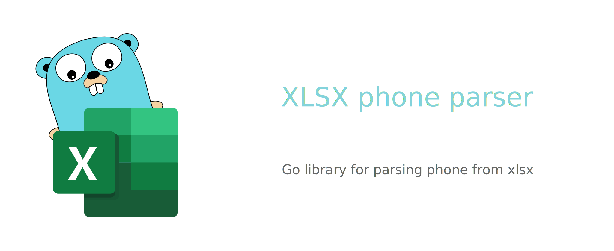

<p align="center"></p>

<p align="center">
    <a href="https://github.com/xuri/excelize/actions/workflows/go.yml"></a>
    <a href="https://goreportcard.com/report/github.com/eclipsemode/go-excel-phone-parser/v1"></a>
    <a href="https://opensource.org/license/mit-0"></a>
</p>

# XLSX phone parser

## Introduction

XLSX phone parser is a personal command line utility written in Go providing a simple console utility program for reading and parsing XLSX files for extracting a list of non-repeating phone numbers. Supports only xlsx files. This library needs Go version 1.23.2 or later.

## Basic Usage

### Installation

```bash
go get github.com/eclipsemode/go-excel-phone-parser/v1
```

### Command line usage with Makefile

Note that path argument can is the path where is original data of xlsx file.

```bash
make run path="./data" city="Moscow" from=2000 to=2020
```

## Contributing

It's a personal narrowly focused project with no contributing.

## Licenses

This program is under the terms of the MIT License. See [https://opensource.org/license/mit-0](https://opensource.org/license/mit-0).

The Excel logo is a trademark of [Microsoft Corporation](https://aka.ms/trademarks-usage). This artwork is an adaptation.

gopher.{ai,svg,png} was created by [Takuya Ueda](https://twitter.com/tenntenn). Licensed under the [Creative Commons 3.0 Attributions license](http://creativecommons.org/licenses/by/3.0/).